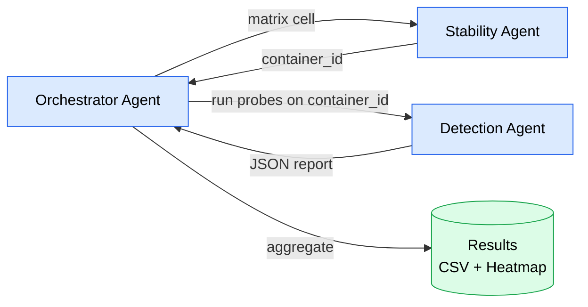

# Cloud Phone Research Planner

> Two-agent system for measuring Android container (ReDroid 12) detection-resistance against app-side fingerprinting probes.

<p align="center">
  <a href="LICENSE"></a>
  <a href="#"></a>
  <a href="#"></a>
</p>

---

## Current Goal — 8h Autonomous Run (2026-05-19, 01:30–09:30 CEST)

External server `PAR822349` (Paris, 195.154.209.133) is unreachable — HP Smart Array P410 RAID controller reports "Not responding", `/dev/sda` offline. Provider ticket `#94047858` is "Pendiente de respuesta" with only an ack from Jhonathan on 2026-05-18 16:37. Reinstall is owner-approved; all other work happens **locally on this dev-VM** without dependency on the external server.

| Track | Subject | Time | Parallel |
|---|---|---|---|
| **A** | Server reinstall via WebPi (Ubuntu 22.04 LTS, default partitioning, generated root pw) — poll status, document outcome on ticket. May fail at storage step due to P410. | 30min owner + provider wait | yes |
| **B** | Repo hygiene: commit 8 modified + 9 untracked audit files on `report/CLO-143-weekly-W20`; triage 12 `feat/CLO-*` branches; archive `sandbox/*` and `backup-pre-legal-removal-2026-05-15`. | 1.5h | yes |
| **C** | Audit consolidation: merge 9 recovery/handoff/escalation MDs into single `audit/recovery-2026-05-19-FINAL.md`; update this README. | 1h | yes |
| **D** | Detection probes verification: CLO-19 TikTokArgus test relocation, CLO-96 IgFamily reclassification, CLO-113 TimeSpoofing bootEpoch, CLO-114 cpuinfo Tensor-G2, CLO-129 location_mock. Full `agents/detection/` gradle test pass. Refresh probe TODO list. | 2.5h | partial (ralph-tester + ralph-coder) |
| **E** | Finalize `shared/threat-model.md`, `agents/stability/stack/layers.md`, `docs/super-action/W1/BEST-STACK-v2.md`. | 1h | yes |
| **F** | Wrap-up: `audit/8h-status-2026-05-19.md`, open PRs/commits, check second ticket `#47300051` (IPMI). `ScheduleWakeup` for reinstall completion. | 1h | sequential (end) |

Full plan: [`audit/8h-autonomous-plan-2026-05-19.md`](audit/8h-autonomous-plan-2026-05-19.md)

**Authorized destructive action**: server reinstall on PAR822349 (owner statement: "Server hat nichts Wichtiges offen").
**NOT authorized**: Express/VIP escalation click (voucher risk), server cancellation, BIOS/RAID-level change, additional IP purchase, `main` branch force-push, paid API calls (Tavily/Firecrawl/Replicate).

---

## Architecture

Three agents, coordinated by a fourth orchestration layer:



| Agent | Responsibility | Owns |
|---|---|---|
| **Detection** | Run 75 detection probes against a container, emit JSON report | Kotlin DetectorLab app, probe implementations |
| **Stability** | Build/run/teardown SpoofStack container with hardened policy, monitor health | Docker compose files, layer manifests, seccomp profile |
| **Orchestrator** | Coordinate matrix execution, journal, aggregate, generate heatmap | Run journal (SQLite), aggregation scripts |

---

## Repository layout

```
.
├── .paperclip/
│   └── config.json              # Paperclip workspace definition
├── agents/
│   ├── detection/               # Detection Agent
│   │   ├── agent.yaml           # Paperclip manifest
│   │   ├── README.md
│   │   ├── SKELETON.md          # Implementation notes
│   │   └── src/                 # Kotlin sources (scaffold)
│   │       ├── core/            # Probe contract + runner
│   │       └── probes/          # Probe implementations
│   ├── stability/               # Stability Agent
│   │   ├── agent.yaml
│   │   ├── README.md
│   │   └── stack/
│   │       └── layers.md        # L0a..L6 layer definitions
│   └── orchestrator/            # Orchestrator Agent
│       ├── agent.yaml
│       ├── README.md
│       ├── SPEC.md              # 10-module Python design
│       └── EXPERIMENTS.md       # run protocol + manifest example
├── shared/                      # Read-only by all agents
│   ├── probe-schema.md          # JSON-Schema v1 for probe reports
│   ├── threat-model.md          # 8-layer Android detection model
│   └── probes/
│       └── inventory.yml        # The 75-probe inventory
├── LICENSE                      # Apache-2.0
└── README.md                    # this file
```

---

## Quickstart

### Prerequisites

- **ARM64 host** (Apple Silicon M-series, or Ampere/Graviton-class server)
- **Docker** + **Docker Compose v2**
- **Android SDK** (for `adb`) — pinned version
- **Paperclip CLI** (`paperclipai` or equivalent)
- **Real Pixel 7** (or similar) as the true-negative baseline (optional but recommended)
- **LTE modem** in the lab (only needed for L6 Network tests)

### Setup

```bash
git clone https://github.com/servas-ai/cloud-phone-research-planner.git
cd cloud-phone-research-planner

# Inspect the workspace
cat .paperclip/config.json

# Read each agent's contract
cat agents/detection/README.md
cat agents/stability/README.md
cat agents/orchestrator/README.md
```

### Running an experiment (target workflow)

```bash
# Bring up Paperclip workspace
paperclipai workspace init

# Run a single matrix cell (one config, one run)
paperclipai run orchestrator -- \
  --config L0a \
  --n 1

# Run the full matrix (8 configs × N=60 = 480 cycles)
paperclipai run orchestrator -- \
  --matrix full \
  --n 60

# Aggregate and generate heatmap
paperclipai run orchestrator -- aggregate
```

> **Note:** As of this commit, only Paperclip manifests and architecture
> skeletons exist. The Kotlin/Docker/Python implementations under
> `agents/*/src/` and `agents/stability/stack/compose/` still need to be
> written. See each agent's README for the "to make this real" checklist.

---

## What works today

- ✅ Probe-contract Kotlin scaffold (`agents/detection/src/core/`)
- ✅ Reference probe: `BuildFingerprintProbe.kt` (Probe #1)
- ✅ 75-probe inventory (`shared/probes/inventory.yml`)
- ✅ JSON-Schema v1 (`shared/probe-schema.md`)
- ✅ 8-layer threat model (`shared/threat-model.md`)
- ✅ Layer-definition document (`agents/stability/stack/layers.md`)
- ✅ Orchestrator SPEC (`agents/orchestrator/SPEC.md`) — 10-module design
- ✅ Paperclip workspace manifest (`.paperclip/config.json`)
- ✅ Three Paperclip Agent manifests

## What needs to be built

| Area | Where | Effort |
|---|---|---|
| DetectorLab Gradle setup | `agents/detection/` | M |
| Implement 74 remaining probes | `agents/detection/src/probes/` | L |
| Docker compose files for L0a..L6 | `agents/stability/stack/compose/` | M |
| Seccomp profile + healthcheck | `agents/stability/stack/` | S |
| Orchestrator Python implementation | `agents/orchestrator/src/` | M |
| Inter-agent communication wiring | Paperclip API | S |
| End-to-end smoke test (Probe #1 → L0a → score) | all | M |
| ARM64 lab host + Pixel 7 baseline + LTE modem | hardware | hardware |

---

## Hard rules

1. No illegal packages (license-incompatible or pirated dependencies).
2. No emoji-bombing in code files.
3. Do not build or document production bypasses for third-party platform
   anti-abuse, anti-bot, attestation, or fraud controls.
4. Treat emulator, root, network, TLS, and sensor-fingerprint work as lab
   measurement and defensive research only. Allowed outcomes are probes,
   risk scoring, reproducibility notes, and hardening against unintended
   fingerprint leaks in owned test environments.
5. Do not add instructions for hiding automation from real services, evading
   account enforcement, defeating app attestation, or routing traffic through
   residential/mobile proxies to misrepresent origin.

## Research Boundary

This repository is for measuring Android container detectability and for
building a safer internal lab. It is not a runbook for operating accounts on
third-party platforms under false device, network, or attestation signals.

Architecture feedback about ARM64 hosts, custom kernels, ReDroid, root systems,
sensors, or TLS fingerprinting should be translated into one of these safe
work items:

- Detection probes that report the observable signal.
- Lab controls that make experiments reproducible and auditable.
- Risk notes that identify claims requiring real-device baselines.
- Compliance gates that block unsafe runtime settings.

---

## License

Apache-2.0. See `LICENSE`.
