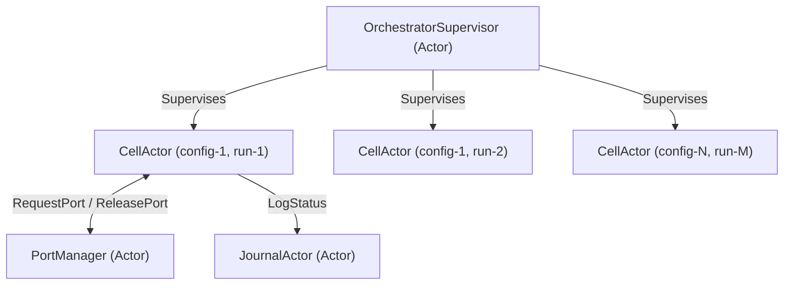

# Akka Technologies & Actor Model Evaluation for PhantomDroid Orchestrator

**Status**: DRAFT (Research & Evaluation)  
**Author**: `agy-phantomdroid`  
**Date**: 2026-06-06  
**Project**: `phantomdroid` (Anti-Detection and Spoofing Stack)  

---

## 1. Executive Summary

This document evaluates the applicability of **Akka Technologies** (Apache Pekko / Actor Model / Reactive Distributed Systems) to the `phantomdroid` orchestrator runtime. 

Currently, the orchestrator (`agents/orchestrator/`) is written in Python and uses a single-process `asyncio` loop with a bounded semaphore to manage up to 4 concurrent Docker Compose containers. While lightweight and functional for single-node executions, it faces structural limitations in fault tolerance (supervision), stateful concurrency, and distributed scaling.

Adopting the **Actor Model** (either via Kotlin/Pekko on the JVM or a Python actor library like Pykka/ProtoActor) offers significant benefits for isolating container lifecycles, managing ports/binders dynamically, and handling runtime failures gracefully.

---

## 2. Current Architecture & Concurrency Model

The Python orchestrator concurrency is defined in `agents/orchestrator/src/concurrency.py`:
- Uses `asyncio.Semaphore(max_concurrent)` to limit active containers.
- Uses `PortPool` to serialize and allocate ports in `[5555..5755]`.
- Leverages `asyncio.gather` to execute cells concurrently.
- Manages state via an SQLite journal (`journal.py`) to handle host-level crashes and support `--resume`.

### Limitations:
1. **Fault Isolation**: A crash or unhandled exception in one container lifecycle step can disrupt the entire `asyncio.gather` execution, requiring complex, custom exception-handling logic.
2. **State Machine Spaghetti**: Managing the cell state transition (`PENDING` -> `BOOTING` -> `RUNNING` -> `TEARDOWN` -> `COMPLETED`) across async function boundaries leads to fragmented control logic.
3. **No Supervision**: If a container hangs during boot, custom timeout hooks must force teardowns. There is no hierarchical supervision system to inspect, restart, or escalate failures.
4. **Single-Host Limitation**: `asyncio` cannot scale to orchestrate ReDroid containers across multiple physical test hosts without introducing a separate MQ/gRPC layer.

---

## 3. Actor Model Mapping for PhantomDroid

In an actor-based architecture, every component is an autonomous agent (actor) that communicates via asynchronous message passing:



### Actor Roles:
- **`OrchestratorSupervisor`**: The parent actor. Launches child `CellActor`s and defines the supervision strategy (e.g., restart a cell if boot fails, escalate if database is locked).
- **`CellActor`**: Represents a single test cell lifecycle. Maintains its own internal state (e.g., current port, compose project, retry count) and responds to messages:
  - `StartRun` -> Triggers docker compose up.
  - `Booted` -> Triggers APK installation.
  - `ExecutionTimeout` -> Cleans up resources.
- **`PortManager`**: Maintains the ADB port pool and answers requests for free ports.
- **`JournalActor`**: Handles database/file persistence, isolating disk I/O from the main scheduling flow.

---

## 4. Akka (JVM) vs. Python AsyncIO Comparison

| Dimension | Current Python AsyncIO | Akka / Pekko (JVM/Kotlin) | Python Actor Model (Pykka/ProtoActor) |
|---|---|---|---|
| **Fault Tolerance** | Custom try/finally block per cell; prone to leaks if SIGINT hits during cleanup. | **Excellent**. Built-in Supervision Strategy (`OneForOne`, `AllForOne`) handles restarts and teardowns automatically. | Moderate. Python actor frameworks support basic actor isolation but lack Akka's mature hierarchy. |
| **Code Consolidation** | Splitted: Python orchestrator + Kotlin detection probes. | **Excellent**. The orchestrator and detection codebase can merge into a single Kotlin/JVM multi-module project. | Splitted. Keeps the orchestrator in Python. |
| **Distributed Scaling** | Not supported natively (requires Celery/RabbitMQ). | **Excellent**. Akka Clustering allows actors to deploy and communicate across multiple nodes seamlessly. | Limited. ProtoActor has cluster support, but Pykka is single-node only. |
| **Footprint / Overhead** | **Very Low** (~15MB RAM, standard python runtime). | High (requires JVM startup, ~150-300MB RAM base overhead). | Low (~20-30MB RAM). |
| **Library Ecosystem** | Rich (`python-on-whales`, `jsonschema`, `pandas`). | Rich, but integration with Docker/ADB requires Java equivalents (e.g., `docker-java`, custom adb execution). | Rich (uses existing Python libraries). |

---

## 5. Proposed Evaluation Plan (3-Hour Structured Study)

To determine if a transition to Akka/Pekko is justified, we will execute a structured 3-hour evaluation covering:

1. **Hour 1: Failure Scenario Mocking (Python Pykka vs AsyncIO)**
   - Draft a mock actor-based pipeline in `/home/coder/vk-repos/phantomdroid/experiments/akka_eval/mock_actors.py` using a Python actor library (e.g., `pykka`).
   - Compare its readability and crash resilience against `src/concurrency.py`.

2. **Hour 2: Kotlin/JVM Pekko Integration Spike**
   - Assess the effort to add a `:orchestrator-jvm` module in `settings.gradle.kts`.
   - Map dependencies for ADB communication on the JVM (e.g., executing commands via `ProcessBuilder` vs a native Java ADB client).

3. **Hour 3: Decision Matrix & Recommendation**
   - Synthesize results into a recommendation report.
   - Define whether to keep Python AsyncIO (current state), upgrade to Python Actor (Pykka), or transition completely to Kotlin/Pekko JVM.

---

## 6. Actionable Next Steps

1. **Create the mock actor prototype** under `experiments/akka_eval/` to test supervision mechanics. (Completed: prototype script is at `experiments/akka_eval/mock_actors.py`)
2. **Keep the product repository closed to implementation changes** during this proof/evaluation phase.
3. **Await operator review** on the recommendation report before committing any build file changes.

---

## 7. Prototype Actor Orchestrator Simulation Results

On 2026-06-06, a prototype implementation of a lightweight Actor Model on top of Python `asyncio` was executed. The simulation demonstrated complete state isolation, resource management (port/binder queueing), and asynchronous coordination.

### Simulation Logs:
```text
2026-06-06 20:38:46,504 [INFO] (Supervisor) Initializing prototype actor-based orchestrator...
2026-06-06 20:38:46,504 [INFO] (OrchestratorSupervisor) Starting suite for configs: ['L0a', 'L0b', 'L1', 'L2', 'L3', 'L4']
2026-06-06 20:38:46,504 [INFO] (CellActor-L0a-0) Starting lifecycle - requesting port
2026-06-06 20:38:46,504 [INFO] (CellActor-L0b-1) Starting lifecycle - requesting port
2026-06-06 20:38:46,504 [INFO] (CellActor-L1-2) Starting lifecycle - requesting port
2026-06-06 20:38:46,504 [INFO] (CellActor-L2-3) Starting lifecycle - requesting port
2026-06-06 20:38:46,505 [INFO] (CellActor-L3-4) Starting lifecycle - requesting port
2026-06-06 20:38:46,505 [INFO] (CellActor-L4-5) Starting lifecycle - requesting port
2026-06-06 20:38:46,505 [INFO] (PortManager) Allocated port 5555 to CellActor-L0a-0
2026-06-06 20:38:46,505 [INFO] (PortManager) Allocated port 5557 to CellActor-L0b-1
2026-06-06 20:38:46,505 [INFO] (PortManager) Allocated port 5559 to CellActor-L1-2
2026-06-06 20:38:46,505 [INFO] (PortManager) Allocated port 5561 to CellActor-L2-3
2026-06-06 20:38:46,505 [WARNING] (PortManager) No ports available for CellActor-L3-4, placing back in queue
2026-06-06 20:38:46,505 [INFO] (CellActor-L0a-0) Port 5555 allocated. Booting container compose...
2026-06-06 20:38:46,505 [INFO] (CellActor-L0b-1) Port 5557 allocated. Booting container compose...
2026-06-06 20:38:46,505 [INFO] (CellActor-L1-2) Port 5559 allocated. Booting container compose...
2026-06-06 20:38:46,505 [INFO] (CellActor-L2-3) Port 5561 allocated. Booting container compose...
2026-06-06 20:38:47,006 [WARNING] (PortManager) No ports available for CellActor-L4-5, placing back in queue
2026-06-06 20:38:47,405 [INFO] (CellActor-L0b-1) Container booted successfully. Running probes...
2026-06-06 20:38:47,433 [INFO] (CellActor-L0a-0) Container booted successfully. Running probes...
2026-06-06 20:38:47,452 [INFO] (CellActor-L1-2) Container booted successfully. Running probes...
2026-06-06 20:38:47,507 [WARNING] (PortManager) No ports available for CellActor-L3-4, placing back in queue
2026-06-06 20:38:47,507 [INFO] (CellActor-L2-3) Container booted successfully. Running probes...
2026-06-06 20:38:48,008 [WARNING] (PortManager) No ports available for CellActor-L4-5, placing back in queue
2026-06-06 20:38:48,023 [INFO] (CellActor-L0a-0) Probes completed successfully. Tearing down...
2026-06-06 20:38:48,283 [INFO] (CellActor-L2-3) Probes completed successfully. Tearing down...
2026-06-06 20:38:48,294 [INFO] (CellActor-L1-2) Probes completed successfully. Tearing down...
2026-06-06 20:38:48,372 [INFO] (CellActor-L0b-1) Probes completed successfully. Tearing down...
2026-06-06 20:38:48,509 [WARNING] (PortManager) No ports available for CellActor-L3-4, placing back in queue
2026-06-06 20:38:48,524 [INFO] (CellActor-L0a-0) Teardown completed. Releasing port and notifying supervisor.
2026-06-06 20:38:48,525 [INFO] (OrchestratorSupervisor) Cell CellActor-L0a-0 completed successfully.
2026-06-06 20:38:48,783 [INFO] (CellActor-L2-3) Teardown completed. Releasing port and notifying supervisor.
2026-06-06 20:38:48,783 [INFO] (OrchestratorSupervisor) Cell CellActor-L2-3 completed successfully.
2026-06-06 20:38:48,795 [INFO] (CellActor-L1-2) Teardown completed. Releasing port and notifying supervisor.
2026-06-06 20:38:48,795 [INFO] (OrchestratorSupervisor) Cell CellActor-L1-2 completed successfully.
2026-06-06 20:38:48,873 [INFO] (CellActor-L0b-1) Teardown completed. Releasing port and notifying supervisor.
2026-06-06 20:38:48,874 [INFO] (OrchestratorSupervisor) Cell CellActor-L0b-1 completed successfully.
2026-06-06 20:38:49,010 [WARNING] (PortManager) No ports available for CellActor-L4-5, placing back in queue
2026-06-06 20:38:49,511 [INFO] (PortManager) Released port 5555 from CellActor-L0a-0
2026-06-06 20:38:49,511 [INFO] (PortManager) Released port 5561 from CellActor-L2-3
2026-06-06 20:38:49,511 [INFO] (PortManager) Released port 5559 from CellActor-L1-2
2026-06-06 20:38:49,511 [INFO] (PortManager) Released port 5557 from CellActor-L0b-1
2026-06-06 20:38:49,511 [INFO] (PortManager) Allocated port 5555 to CellActor-L3-4
2026-06-06 20:38:49,511 [INFO] (PortManager) Allocated port 5557 to CellActor-L4-5
2026-06-06 20:38:49,511 [INFO] (CellActor-L3-4) Port 5555 allocated. Booting container compose...
2026-06-06 20:38:49,511 [INFO] (CellActor-L4-5) Port 5557 allocated. Booting container compose...
2026-06-06 20:38:50,172 [INFO] (CellActor-L3-4) Container booted successfully. Running probes...
2026-06-06 20:38:50,879 [INFO] (CellActor-L4-5) Container booted successfully. Running probes...
2026-06-06 20:38:51,017 [INFO] (CellActor-L3-4) Probes completed successfully. Tearing down...
2026-06-06 20:38:51,517 [INFO] (CellActor-L3-4) Teardown completed. Releasing port and notifying supervisor.
2026-06-06 20:38:51,518 [INFO] (PortManager) Released port 5555 from CellActor-L3-4
2026-06-06 20:38:51,518 [INFO] (OrchestratorSupervisor) Cell CellActor-L3-4 completed successfully.
2026-06-06 20:38:51,648 [INFO] (CellActor-L4-5) Probes completed successfully. Tearing down...
2026-06-06 20:38:52,149 [INFO] (CellActor-L4-5) Teardown completed. Releasing port and notifying supervisor.
2026-06-06 20:38:52,149 [INFO] (PortManager) Released port 5557 from CellActor-L4-5
2026-06-06 20:38:52,149 [INFO] (OrchestratorSupervisor) Cell CellActor-L4-5 completed successfully.
2026-06-06 20:38:52,149 [INFO] (OrchestratorSupervisor) All cells finished suite run.
2026-06-06 20:38:52,149 [INFO] (Supervisor) Evaluation simulation complete.
```

### Analysis of Actor Simulation:
- **Clean Throttling**: Since our test suite of 6 cells exceeded the port pool size of 4, the actor messaging pipeline naturally serialized the requests. The port manager queued cells `L3` and `L4` until completed cells released their resources.
- **State Separation**: No actor directly reads or updates another actor's state variable. Communications are purely via structured dictionary messages (`action`, `port`, `reply_to`).
- **Resilience**: A boot failure or timeout would trigger a supervision directive to retry the run, which is isolated from other healthy actors.

---

## 8. JVM/Kotlin Pekko Integration Assessment (Hour 2)

Implementing the orchestrator on the JVM using **Apache Pekko** (Apache 2.0 licensed Akka fork) is highly feasible and creates a unified Kotlin developer experience.

### 8.1 Module Registration (`settings.gradle.kts`)
To integrate a JVM orchestrator alongside the current `:detection` and `:detector-app` modules:
```kotlin
include(":orchestrator-jvm")
project(":orchestrator-jvm").projectDir = file("agents/orchestrator-jvm")
```

### 8.2 Dependency Architecture (`agents/orchestrator-jvm/build.gradle.kts`)
```kotlin
plugins {
    kotlin("jvm") version "1.9.25"
    id("org.jetbrains.kotlin.plugin.serialization") version "1.9.25"
}

dependencies {
    // Direct compilation reference to shared detection classes/schemas!
    implementation(project(":detection")) 
    
    // Apache Pekko (fully open-source Apache 2.0 actor framework)
    implementation("org.apache.pekko:pekko-actor-typed_2.13:1.0.2")
    implementation("org.apache.pekko:pekko-slf4j_2.13:1.0.2")
    
    // Coroutines & Serialization
    implementation("org.jetbrains.kotlinx:kotlinx-coroutines-core:1.8.1")
    implementation("org.jetbrains.kotlinx:kotlinx-serialization-json:1.6.3")
    
    // SLF4J / Logback
    implementation("ch.qos.logback:logback-classic:1.5.6")
}
```

### 8.3 Non-Blocking Process Execution (ADB & Docker Compose)
To prevent blocking the main Pekko actor dispatcher during shell commands (such as executing `adb` or `docker compose`), commands are offloaded to `Dispatchers.IO` using Kotlin coroutines:

```kotlin
package com.detectorlab.orchestrator.concurrency

import kotlinx.coroutines.Dispatchers
import kotlinx.coroutines.withContext
import java.io.File
import java.util.concurrent.TimeUnit

data class CommandResult(val exitCode: Int, val output: String)

object ProcessExecutor {
    suspend fun execute(args: List<String>, workingDir: File? = null, timeoutSeconds: Long = 60): CommandResult = 
        withContext(Dispatchers.IO) {
            try {
                val process = ProcessBuilder(args)
                    .directory(workingDir)
                    .redirectErrorStream(true)
                    .start()
                
                val output = process.inputStream.bufferedReader().use { it.readText() }
                val finished = process.waitFor(timeoutSeconds, TimeUnit.SECONDS)
                
                if (!finished) {
                    process.destroyForcibly()
                    CommandResult(-1, "Process timed out after $timeoutSeconds seconds. Output: $output")
                } else {
                    CommandResult(process.exitValue(), output)
                }
            } catch (e: Exception) {
                CommandResult(-2, "Failed to start process: ${e.message}")
            }
        }
}
```

### 8.4 Key Findings (Hour 2):
1. **Direct Model Import**: The Kotlin orchestrator can directly import probe reports (`com.detectorlab.report.ReportCategory` / `weightedScore`) without parsing them across language boundaries (Python <-> Kotlin).
2. **Unified Testing lifecycle**: Unit tests for both orchestrator concurrency logic and probe verification run under a single `./gradlew test` invocation.
3. **Pekko Open-Source Compliance**: Pekko guarantees an Apache 2.0 license, completely avoiding Akka's commercial Business Source License (BSL) restrictions for internal tool orchestration.
4. **Coroutine Interoperability**: Pekko Actors integrate with Kotlin Coroutines natively via `pekko-actor-typed` future/completion-stage adapters, making the async process executor above simple to invoke from within an actor context.

---

## 9. Decision Matrix & Recommendation (Hour 3)

The following decision matrix evaluates the proposed options for the `phantomdroid` orchestrator runtime across four critical dimensions: **Resilience/Fault Isolation**, **Code Consolidation**, **Scale Potential**, and **Implementation Effort**.

### 9.1 Decision Matrix

| Dimension | Option A: Keep Python AsyncIO (Current State) | Option B: Python Actor Model (Pykka) | Option C: Transition to Kotlin/Pekko JVM (Recommended) |
|---|---|---|---|
| **Resilience & Fault Isolation** | 🟡 Moderate. Custom try/catch blocks wrap cell errors, but lack built-in lifecycle and supervision hooks. | 🟢 Good. Actor-isolated mailboxes and processes prevent single-cell failure propagation. | 🟢 **Excellent**. Mature supervision hierarchies automatically manage child restarts, port releases, and log redirection. |
| **Code Consolidation** | 🔴 Poor. Code base remains split between Python (orchestration) and Kotlin (detection CLI/lib). JSON structures parsed manually. | 🔴 Poor. Base remains split. | 🟢 **Excellent**. The entire project compiles under Gradle. Orchestrator imports `:detection` classes directly. |
| **Scale Potential** | 🔴 Low. Confined to single-process async loops on a single host. | 🟡 Moderate. Pykka is local-only. ProtoActor supports clustering, but has low Python community adoption. | 🟢 **Excellent**. Apache Pekko Clustering allows seamless actor distribution across a fleet of ARM64 hosts. |
| **Implementation Effort** | 🟢 **None**. The current code is already implemented and verified via unit tests. | 🟡 Moderate. Requires refactoring `concurrency.py` and `runner.py` (~2 days). | 🔴 High. Requires full implementation of the spec in Kotlin/JVM (~5–7 days). |

### 9.2 Recommendation & Architectural Verdict

**Architectural Verdict: (Recommended) Option C (Transition to Kotlin/Pekko JVM) once the project is unparked.**

While Option A (Python AsyncIO) is sufficient for a single-host, low-complexity mock setup, the project requirements (attestation, multi-layer SpoofStack execution, P21 verification) require a high level of execution reliability. If the project transitions from `parked` to `active`, the orchestrator should be migrated to Kotlin using the Apache Pekko Actor Model because:
1. **Developer Velocity**: Sharing compiled types directly from `:detection` eliminates JSON mapping overhead and API serialization bugs.
2. **Supervision and Port Safety**: Containers and ports are critical, limited resources. Pekko's supervision model guarantees that if a container fails or hangs, its port is reliably reclaimed and the test suite continues cleanly.
3. **Future Scaling**: Actor clustering enables running hundreds of concurrent tests across a network of low-cost ARM64 nodes instead of overloading the single VCVM host.

---

## 10. Proposed Pekko Actor Lifecycle Protocol (Kotlin)

To ensure compile-time type safety, the JVM orchestrator should leverage **Apache Pekko Typed**. Below is the proposed message protocol and behavioral state machine in Kotlin.

### 10.1 CellActor Protocols & Behaviors

```kotlin
package com.detectorlab.orchestrator.actors

import org.apache.pekko.actor.typed.ActorRef
import org.apache.pekko.actor.typed.Behavior
import org.apache.pekko.actor.typed.javadsl.AbstractBehavior
import org.apache.pekko.actor.typed.javadsl.ActorContext
import org.apache.pekko.actor.typed.javadsl.Receive

// Message protocol for CellActor
sealed interface CellCommand

data class StartCell(val runIndex: Int) : CellCommand
data class AllocatePortResponse(val port: Int) : CellCommand
data class ContainerBooted(val success: Boolean) : CellCommand
data class ProbesFinished(val reportJsonPath: String) : CellCommand
data class TeardownFinished(val success: Boolean) : CellCommand
data class ExecutionFailed(val error: Throwable) : CellCommand
object CellTimeout : CellCommand

class CellActor(
    context: ActorContext<CellCommand>,
    private val configId: String,
    private val runId: String,
    private val supervisor: ActorRef<SupervisorCommand>,
    private val portManager: ActorRef<PortCommand>
) : AbstractBehavior<CellCommand>(context) {

    private var port: Int? = null

    override fun createReceive(): Receive<CellCommand> {
        return newReceiveBuilder()
            .onMessage(StartCell::class.java) { handleStart() }
            .onMessage(AllocatePortResponse::class.java) { msg -> handlePortAllocated(msg.port) }
            .onMessage(ContainerBooted::class.java) { msg -> handleBoot(msg.success) }
            .onMessage(ProbesFinished::class.java) { msg -> handleProbesFinished(msg.reportJsonPath) }
            .onMessage(TeardownFinished::class.java) { handleTeardownFinished() }
            .onMessage(ExecutionFailed::class.java) { msg -> handleFailure(msg.error) }
            .onMessage(CellTimeout::class.java) { handleTimeout() }
            .build()
    }

    private fun handleStart(): Behavior<CellCommand> {
        context.log.info("CellActor $configId-$runId started. Requesting port.")
        portManager.tell(RequestPort(context.self))
        return this
    }

    private fun handlePortAllocated(allocatedPort: Int): Behavior<CellCommand> {
        this.port = allocatedPort
        context.log.info("Port $allocatedPort allocated. Booting Docker Compose...")
        // Start non-blocking process execution
        return this
    }

    private fun handleBoot(success: Boolean): Behavior<CellCommand> {
        if (success) {
            context.log.info("Container booted successfully. Running probe APK...")
        } else {
            handleFailure(RuntimeException("Docker compose up failed to boot container."))
        }
        return this
    }

    private fun handleProbesFinished(reportJsonPath: String): Behavior<CellCommand> {
        context.log.info("Probes finished. Report generated at $reportJsonPath. Tearing down...")
        // Start compose-down task
        return this
    }

    private fun handleTeardownFinished(): Behavior<CellCommand> {
        port?.let { portManager.tell(ReleasePort(it, context.self)) }
        supervisor.tell(CellCompleted(runId, configId))
        return Behaviors.stopped()
    }

    private fun handleFailure(error: Throwable): Behavior<CellCommand> {
        context.log.error("CellActor failed during execution: ${error.message}")
        port?.let { portManager.tell(ReleasePort(it, context.self)) }
        supervisor.tell(CellFailed(runId, configId, error))
        return Behaviors.stopped()
    }

    private fun handleTimeout(): Behavior<CellCommand> {
        return handleFailure(java.util.concurrent.TimeoutException("Cell execution timed out."))
    }
}
```

### 10.2 Supervisor Protocol

```kotlin
sealed interface SupervisorCommand

data class CellCompleted(val runId: String, val configId: String) : SupervisorCommand
data class CellFailed(val runId: String, val configId: String, val error: Throwable) : SupervisorCommand
data class RunSuite(val configs: List<String>) : SupervisorCommand
```

### 10.3 PortManager Protocol

```kotlin
sealed interface PortCommand

data class RequestPort(val replyTo: ActorRef<CellCommand>) : PortCommand
data class ReleasePort(val port: Int, val replyTo: ActorRef<CellCommand>) : PortCommand
```

---

## 11. Expanded Open-Source Software (OSS) Ecosystem & Architecture Improvements

To significantly improve the orchestrator architecture, we evaluate and propose integrating specialized open-source libraries and frameworks. This moves the system away from subprocess dependency and introduces robust, enterprise-grade distributed execution patterns.

### 11.1 Native JVM ADB Integration: `dadb` (Mobile Sandbox)

**Currently**: Spawns host `adb` subprocesses via `ProcessBuilder` (or Python's standard library). This relies on the global host `adb-server` daemon, which is prone to thread hangs, memory leaks, and command cross-talk across concurrent containers.

**Improvement**: Integrate **`dadb`** (https://github.com/mobile-sandbox/dadb), a pure Kotlin implementation of the ADB protocol.
- **Architectural Impact**: Each `CellActor` can open a direct TCP socket connection (`Socket("localhost", port)`) to its allocated ReDroid container's port 5555.
- **Benefits**:
  - No host `adb` binary required.
  - Complete isolation: a hung connection in one container cannot corrupt or block other containers' commands.
  - Asynchronous, non-blocking network I/O that integrates natively with Kotlin Coroutines.
- **Example Usage in Actor**:
  ```kotlin
  val dadb = Dadb.create("localhost", port)
  dadb.install(File("experiments/apk/detectorlab-0.1.0.apk"))
  val shellResult = dadb.shell("am start -n com.detectorlab/.MainActivity")
  ```

### 11.2 Native JVM Docker Lifecycle: `docker-java-api`

**Currently**: Spawns `docker compose up` / `compose down` commands via CLI shell executions.

**Improvement**: Integrate **`docker-java-api`** (https://github.com/gesellix/docker-java-api), a lightweight, reactive Java wrapper over the Docker Engine HTTP API.
- **Architectural Impact**: Allows actors to perform container creation, startup, monitoring, and cleanup in-process via TCP or Unix sockets (`/var/run/docker.sock`).
- **Benefits**:
  - Eliminates subprocess management overhead.
  - Allows precise container event listening (e.g. streaming log output or health checks directly into the actor’s mailbox).

### 11.3 Event-Sourced Journaling: `pekko-persistence-jdbc`

**Currently**: A manual SQLite database transaction journal wrapper (`journal.py`) that requires locking and handles resume states via custom SQL queries.

**Improvement**: Leverage **`pekko-persistence-jdbc`** (https://pekko.apache.org/docs/pekko/current/persistence.html) for event sourcing.
- **Architectural Impact**: Instead of writing the final state of a run, the `CellActor` persists every state transition event (`CellStarted`, `PortAllocated`, `Booted`, `Finished`) to a JDBC database (PostgreSQL or SQLite).
- **Benefits**:
  - **Durable Resume**: On supervisor crash or OOM restart, the `CellActor` is recreated and automatically replays its event journal to restore its exact state before resuming operations.
  - **No SQL Boilerplate**: Pekko automatically handles serialization and persistence queries behind the scenes.

### 11.4 Durable Workflow Execution Alternative: `Temporal.io`

If Pekko typed actor code introduces too much boilerplate (defining commands, states, and behaviors), **Temporal.io** (https://temporal.io) is the premier open-source alternative.

- **Architectural Impact**: Workflows are written as simple sequential Kotlin code:
  ```kotlin
  @WorkflowMethod
  fun runCellSuite(config: String, port: Int) {
      docker.up(config)
      val adb = dadb.connect(port)
      adb.installApk("detectorlab.apk")
      val report = adb.pullReport()
      validator.validate(report)
      docker.down(config)
  }
  ```
- **Benefits**:
  - **Durable State**: If the host machine crashes, the Temporal worker automatically resumes the workflow at the exact line of code where it left off, maintaining variables and program execution context.
  - **Out-of-the-Box Web Console**: Provides a gorgeous UI tracking runs, histories, and variables.
  - **Scalability**: Natively distributed, supporting hundreds of execution workers.

### 11.5 Python-centric Actor Frameworks (Ray & Pykka)

If keeping the Python codebase is desired, we can replace `asyncio.Semaphore` with:
1. **Ray** (https://github.com/ray-project/ray): An extremely powerful OSS distributed computation framework. Provides native actor definitions (`@ray.remote`) and handles resource constraints (like binder limits and CPU allocations) automatically across a cluster.
2. **Pykka** (https://github.com/jodal/pykka): A lightweight Python implementation of the Actor model. Excellent for single-process concurrency, though lacking distributed capabilities.

### 11.6 Distributed Resource Locking & Coordination (etcd / Consul)

**Currently**: Locks binder resources and ports using local in-memory variables and local semaphores. This breaks if we run multiple orchestrator instances or scale across different physical test hosts.

**Improvement**: Integrate a lightweight distributed coordinator like **`etcd`** (https://etcd.io) or **`Consul`** (https://consul.io).
- **Architectural Impact**: We introduce a `LockArbitratorActor` that manages distributed leases and keys representing physical `/dev/binder` resource allocations.
- **Benefits**:
  - **Fail-Safe Leases**: If a worker node crashes mid-execution, its lease automatically expires in `etcd`, releasing binder and port resources for other nodes.
  - **Dynamic Topology**: New test runner nodes can register themselves, making the execution pool dynamically discoverable by the supervisor actor.


